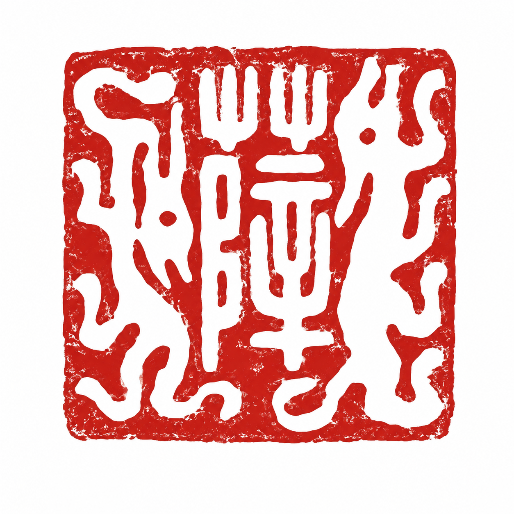

<div align="center">
  <a href="https://willxue.com">
    
  </a>

  <h1>Will Xue's Blog</h1>

  <p>一个关于技术、艺术、设计与代码的轻量级全静态作品集和 Markdown 博客。</p>

  <p>
    <a href="https://github.com/xuewill/xue/actions/workflows/check.yml"></a>
    <a href="https://github.com/xuewill/xue/actions/workflows/deploy.yml"></a>
    <a href="https://svelte.dev"></a>
    <a href="https://pages.cloudflare.com"></a>
    <a href="./LICENSE"></a>
  </p>

  <p>
    <a href="./README.md">English</a> · <strong>简体中文</strong>
  </p>
</div>

## ✨ 项目简介

本仓库是 [willxue.com](https://willxue.com) 的源代码。首页延续原作品集的视觉结构，Projects 使用图片卡片网格，Blog 使用按年份组织的横向文章列表。Blog 和 Project 均使用 Markdown 编写，并在构建阶段生成完全预渲染的静态站点。

线上不需要 Node.js 服务、数据库或 Worker SSR 运行时。生成的 `build/` 目录可以部署到任意静态托管服务。

### 主要特性

- SvelteKit 2、Svelte 5 和 TypeScript
- 使用 Velite 管理类型安全的 Markdown 与 YAML 内容
- 使用 Shiki 在构建阶段完成代码语法高亮
- 通过 `@sveltejs/adapter-static` 生成全静态页面
- 自动检查 Hero 图片、文章封面和 Markdown 正文图片
- 内置 RSS、Sitemap、robots 文件和响应式图片资源
- 提供稳定标签页、文章系列，以及 Blog、Project、Album 之间的跨内容链接
- 提供统一的 `/archive` 时间线，汇总 Blog、Project、Album，并支持简单类型筛选
- 构建时自动生成社交分享图，并为作者、文章、项目和 Album 输出 JSON-LD
- 响应式环境灯、文章目录和移动端主题控制
- 支持键盘访问的页脚预览卡、真实 GitHub 数据和可选的 X 官方数据
- Chromium 全量回归、Firefox/WebKit 烟雾测试、axe 检查和构建期断链校验
- 单图、页面 JS/CSS gzip、构建增长来源和实验室 Core Web Vitals 预算
- 使用 GitHub Actions 检查并部署到 Cloudflare Pages

## 🧰 技术栈

| 分类 | 技术 |
| --- | --- |
| 应用框架 | SvelteKit 2 + Svelte 5 |
| 开发语言 | TypeScript |
| 内容系统 | Markdown + YAML + Velite |
| 构建工具 | Vite + `@sveltejs/adapter-static` |
| 托管平台 | Cloudflare Pages |
| CI/CD | GitHub Actions + Wrangler |

## 🚀 快速开始

### 环境要求

- [Node.js](https://nodejs.org/) 22.13 或更高版本
- npm（安装 Node.js 时会一并安装）

### 安装和启动

```bash
git clone https://github.com/xuewill/xue.git
cd xue
npm ci
npm run dev
```

打开 Vite 输出的本地地址，通常是 `http://localhost:5173`。

### 生产构建

```bash
npm run verify
npm run test:e2e
npm run preview
```

静态产物生成在 `build/`。`npm run verify` 会依次执行 lint、单元测试、内容与类型检查及生产构建；端到端测试会自动启动该构建的本地预览。

## 📜 可用命令

| 命令 | 说明 |
| --- | --- |
| `npm run dev` | 启动 Vite 开发服务器 |
| `npm run lint` | 检查 JavaScript、TypeScript 和 Svelte 文件 |
| `npm test` | 生成 Velite 数据并运行 Vitest 单元测试 |
| `npm run test:e2e` | 运行 Chromium 回归、Firefox/WebKit 烟雾测试和 axe 检查 |
| `npm run content -- --help` | 查看内容创建、检查、预览和发布 CLI |
| `npm run check:links` | 检查生成站点的内部链接并探测外部链接 |
| `npm run check:published` | 确认草稿没有进入生产详情路由和订阅源 |
| `npm run check:performance` | 检查生成图片、JS/CSS gzip 预算和构建增长来源 |
| `npm run check:deployment` | 使用 `DEPLOYMENT_URL` 对 Pages 部署做烟雾检查 |
| `npm run check` | 检查内容、同步 SvelteKit 类型并运行 `svelte-check` |
| `npm run build` | 检查内容并生成静态生产版本 |
| `npm run verify` | 运行 lint、单测、检查、构建、性能预算、草稿泄露和断链校验 |
| `npm run preview` | 在本地预览生产构建 |
| `npm run validate:content` | 检查内容 schema、图片引用和正文图片 alt 文本 |
| `npm run validate:generated` | 检查已跟踪的 Web Manifest 是否与 YAML 源一致 |
| `npm run check:watch` | 以监听模式运行 Svelte 诊断 |

## 🗂️ 项目结构

```text
.
├── .env.example             # 可选的社交平台 API 凭证
├── .github/workflows/       # Pull Request 检查和生产部署
├── scripts/                 # 内容检查脚本
├── src/
│   ├── content/config/      # 站点、首页、标签和相册 YAML 配置
│   ├── content/posts/       # Blog Markdown 文件
│   ├── content/projects/    # Project Markdown 文件
│   ├── lib/components/      # 可复用 Svelte 组件
│   ├── lib/generated/       # 检查和构建前生成的 Velite 数据
│   ├── lib/server/          # 构建阶段获取社交平台数据
│   ├── lib/types/           # 内容与社交数据的共享类型
│   └── routes/              # 页面、RSS 和 Sitemap 路由
├── static/                  # 图片、字体、图标、生成的 manifest 和安全响应头
├── tests/                   # Vitest 单元测试与 Playwright 浏览器测试
├── svelte.config.js         # Svelte 预处理和静态适配器配置
├── velite.config.ts         # 内容 schema、转换、排序和生成规则
└── wrangler.toml            # Cloudflare Pages 输出配置
```

## ⚙️ 站点配置

- `src/content/config/site.yaml`：站点元数据、发布时区、作者、图标、manifest、导航、社交链接及其回退数据。
- `src/content/config/home.yaml`：Hero 图片以及 About 和 Projects 文案。
- `src/content/config/tags.yaml`：有限且稳定的标签 slug、显示名和说明。
- `src/content/config/metadata.yaml`：地点、角色和媒介 taxonomy 的唯一来源。
- `src/content/config/album.yaml`：相册图片顺序、路径、说明和视觉倾斜值。
- `velite.config.ts`：严格 schema、文件名 slug、TOC、草稿过滤、排序和静态资源检查。
- `src/app.css`：颜色、字体、尺寸和响应式样式。
- `static/`：不经过转换、直接复制到站点根目录的文件。

测试、检查、构建和开发服务器启动前，Velite 会生成并覆盖已忽略的 `src/lib/generated/content/`。Sharp 还会为 Hero、Album、封面、头像和 Markdown 正文图片生成带内容哈希的 WebP 多尺寸版本，并写入已忽略的 `static/generated/media/`，同时在 `static/generated/og/` 生成 1200×630 PNG 分享图。源图片以及 YAML/Markdown 中的路径仍是唯一可编辑来源，不要直接修改生成图片。`static/site.webmanifest` 是由 `site.yaml` 生成并纳入版本管理的快照，CI 会阻止 YAML 和该快照发生漂移。

响应式图片会输出固有宽高和 `srcset`。Hero 先加载当前页，再逐张预取后续页面，原有自动播放顺序不变；Album 首屏只加载小尺寸响应式缩略图，打开照片后才请求较大的灯箱版本。Cloudflare Pages 会为 `/generated/*` 返回 `Cache-Control: public, max-age=31536000, immutable`，源图或编码规格变化时文件名哈希也会变化。

相册图片尺寸和相机信息（相机、镜头、焦距、光圈、快门速度与 ISO）会在 Velite 构建时从源图片的 EXIF 数据中自动读取。如果某张图片缺少某个 EXIF 字段，相册会在该字段显示 `—`。

Album 日期使用显式的 `date` 和 `dateKind`。Blog 地点、Project 地点/角色/媒介以及 Album 地点/媒介都必须使用 `metadata.yaml` 中的 slug；空数组合法且不会渲染为空标签。

配置对象会拒绝未知字段。Hero 和 Album ID 必须唯一，Hero 宽高必须与源文件一致，所有 Project（包括草稿）的 `order` 也必须唯一。标签必须使用配置内的 lowercase kebab-case slug；Post、Project、Album 和 series 引用会在过滤草稿前检查缺失、重复、自引用、草稿目标和顺序冲突。校验错误会指出对应字段和修正方式。

Hero 图片位于 `static/home/sketchbook/`。在 `home.yaml` 的 `hero.images` 下增删条目或调整顺序即可控制前台内容：

```yaml
- id: image-id
  src: /home/sketchbook/image.png
  alt: Accessible description
  caption: Image caption
  width: 1280
  height: 720
  enabled: true
```

请让 `width` 和 `height` 与源图片尺寸一致，避免页面布局偏移。如果暂时不希望展示某张图片，可保留配置并设置 `enabled: false`。

Playwright 会持续检查完整 Hero 自动播放传输量不超过 2.5 MiB、Album 首屏不超过 2 MiB。当前桌面测试数据约为：首页自动播放完成后 1.36 MiB，Album 打开灯箱前 0.67 MiB。

生产构建完成后，`npm run check:performance` 会读取 [`performance-budget.json`](./performance-budget.json)：按角色检查每张生成图片的最大体积，检查关键 JS/CSS 文件与代表路由的 gzip 预算，并与 [`plans/performance-baseline.json`](./plans/performance-baseline.json) 中的 Vite 语义 chunk 基线比较。失败信息会指出具体图片、路由、语义 chunk 和带哈希文件；即使尚未触及硬限制，只要增长达到 1 KiB 也会输出来源。只有确认构建增长合理后，才应运行 `node scripts/check-performance-budget.mjs --write-baseline` 接受新基线。

Chromium 还会在固定的 4 倍 CPU 降速和 40 ms 网络延迟实验室配置下检查首页与 Album。CI 使用 Core Web Vitals 的 good 边界：LCP `<= 2.5 s`、CLS `<= 0.1`，并用首页真实点击的观测延迟 `<= 200 ms` 作为 INP 等价的合成回归。实验室结果只用于稳定回归，不代表生产用户体验；Cloudflare Web Analytics 的第 75 百分位 RUM 仍是跨设备、网络、缓存和地域判断真实 LCP、CLS、INP 的依据。有限的合成交互也不能替代真实用户 INP。

## 🖥️ 界面行为

- 顶部主导航使用 `home` 和 `blog`。项目详情页位于 `/home/[slug]`，旧的 `/work/*` 地址会永久重定向到 `/home/*`。
- 左侧吊灯会跟随响应式内容轨道移动，但会在正文区域之前停止；右侧拉绳固定在视口右边缘，不会遮挡顶部导航。
- 文章目录会在大屏幕上扩宽。移动端主题切换使用无边框图标，并通过竖线与导航文字分隔。
- Blog 标签索引位于 `/blog/tags`，文章标签会链接到预渲染的标签页；文章和 Project 底部可展示系列、相关文章、相关项目和 Album 作品，同时不会把无关正文打进客户端包。
- 页脚 Social 图标使用 20 px 图案和 32 px 点击区域。预览卡支持鼠标悬浮与键盘聚焦；触屏设备会直接打开链接，不显示浮层。

## 📈 隐私友好统计

生产环境已经启用 Cloudflare Pages Web Analytics，并从 2026 年 7 月 30 日开始采集。Cloudflare 会在部署时注入唯一一份官方 beacon；不要把 token 或第二份 beacon 脚本写入仓库。

当前 CSP 已允许 Cloudflare 官方脚本和 RUM 上报端点。Web Analytics 不使用 Cookie 或 `localStorage`，可提供聚合页面访问、来源、SPA 导航和 Core Web Vitals，但目前不支持自定义交互事件。因此 Album 打开、内容流转漏斗和 RSS 转化暂不追踪，只有真实访问量证明有价值后才考虑小型第一方事件方案。

启用检查、隐私边界、首个现场数据检查点，以及 7 月 30 日至 8 月 13 日的观察窗口记录在 [`plans/analytics-baseline.md`](./plans/analytics-baseline.md)。前三天样本已经证明采集正常，但数量太少且包含 headless 验证流量，暂不用于功能决策。

## ✅ 持续质量

`npm run verify` 现在会在构建完成后检查所有生成页面的内部链接和锚点，并探测文章与资料页中的外部链接。明确返回 `404` 或 `410` 会让检查失败；临时限流、服务端错误和网络失败会标记为“无法确认”，避免第三方短时故障导致所有 Pull Request 波动。需要把无法确认也视为失败时，可设置 `LINK_CHECK_STRICT_EXTERNAL=1`。

Playwright 会在 Chromium 中运行完整的交互、响应式、SEO、性能和无障碍回归；精简的公开页面主流程还会在 Firefox 与 WebKit 中执行。axe 会按可自动检测的 WCAG A/AA 规则检查 5 个代表路由。`npm run verify` 会在生产构建后执行生成图片和 gzip 构建预算，因此 GitHub Actions 会在预览部署前以具体资源归因失败。YAML 与 Markdown schema 另有独立的有效/无效夹具，不再只依赖真实内容集合。

Wrangler 上传 Cloudflare Pages 后，部署工作流会把本次部署的精确 URL 传给 `npm run check:deployment`。首页、Blog、Album、RSS、Sitemap 和真实 404 全部通过后，部署任务才算成功。

## 🔗 Social 预览数据

社交数据由 `src/lib/server/social.ts` 在静态构建阶段读取，再通过根布局传给页脚。访客打开预览卡时不会从浏览器请求第三方 API，因此 API 凭证不会暴露到前端。

| 平台 | 数据来源 | 失败回退 |
| --- | --- | --- |
| GitHub | 公开用户 API 和近期贡献日历 | 最近一次确认的公开数字；贡献服务不可用时显示中性方格 |
| X | 配置 `X_BEARER_TOKEN` 后使用 X 官方 API | 使用本地姓名、头像和简介，不伪造关注数字 |
| Email | 本地信封视觉效果 | 不发起网络请求 |

根据需要把 `.env.example` 中的可选变量配置到本地或部署构建环境：

```bash
X_BEARER_TOKEN=
GITHUB_TOKEN=
```

本地构建可以不配置 `GITHUB_TOKEN`，但配置后可避免 GitHub 匿名 API 的频率限制。`X_BEARER_TOKEN` 需要有效的 X API 权限。由于站点是全静态的，Social 数据会在运行 `npm run build` 并重新部署时更新，而不是访客每次打开卡片时实时请求。

## ✍️ 发布内容

仓库提供同时适合人工操作和脚本调用的 Content CLI。它会按当前 schema 创建草稿、给出可执行的错误提示，并且不会提交、push、创建 Pull Request 或部署。

```bash
# 交互式创建草稿
npm run content -- new post
npm run content -- new project

# 检查并预览草稿，包括只在开发模式存在的详情路由
npm run content -- check post/article-title
npm run content -- preview post/article-title --open

# 修改文件前运行完整发布门禁
npm run content -- publish post/article-title --dry-run

# 在本地设置 draft: false 并运行 npm run verify
npm run content -- publish post/article-title
```

`new` 和 `publish` 支持 `--dry-run`。CI 或编辑器集成应使用 `--no-input` 并显式传入完整名称 flag。需要不含 npm 脚本标题的 JSON 时，使用 `npm run --silent content -- check --json`。CLI 用退出码 `2` 表示用法错误，`3` 表示内容或发布校验失败，`1` 表示其他运行错误；同时支持 `NO_COLOR` 和 `--no-color`，并且只在 stdin 是 TTY 时提问。

`preview` 默认只监听 `127.0.0.1`。只有需要局域网内其他设备访问时才传 `--host`，只有希望自动打开浏览器时才传 `--open`。按 Ctrl-C 停止服务器。

### 发布清单

1. 使用 `new post` 或 `new project` 创建草稿。
2. 补充正文和源图片。每张 Markdown 正文图片都必须有简洁、能表达内容或用途的 alt；空白、只复述文件名或占位 alt 会校验失败。
3. 运行 `check`，再用 `preview` 检查准确详情路由。
4. 运行 `publish <target> --dry-run`。
5. 运行 `publish <target>`，将 `draft` 改为 `false` 并执行 `npm run verify`。
6. 推送 Pull Request，在桌面和手机上检查 CI 评论中的 Cloudflare Pages URL。
7. 预览烟雾检查通过后再合并；生产工作流会在部署后执行同一组端点检查。

未来日期文章必须按 `site.yaml` 配置的时区保持草稿，当前静态站点不会定时重建。发布检查失败时 CLI 会恢复原草稿，并且所有创建命令都不会覆盖已有 slug。

### Frontmatter 参考

CLI 只写入必要 frontmatter；可选关系字段应按真实内容需要补充。Blog 支持：

```md
---
title: Article title
description: Article summary
date: '2026-07-17'
updated: '2026-07-18'
draft: false
tags:
  - publishing
cover: /images/blog/cover.webp
series:
  slug: site-notes
  title: Site Notes
  order: 4
related:
  - another-article
relatedProjects:
  - project-name
relatedAlbum:
  - album-photo-id
---

Article body.
```

文件名必须是 lowercase kebab-case slug，并生成 `/blog/<slug>`。标签只能使用 `src/content/config/tags.yaml` 中声明的值。Project 支持：

```md
---
title: Project title
description: Project summary
startYear: 2026
endYear: 2026
status: completed
category: design
locations:
  - stanford
roles:
  - designer
media:
  - fashion-design
cover: /images/projects/cover.webp
order: 10
updated: '2026-07-18'
draft: false
relatedPosts:
  - article-title
relatedAlbum:
  - album-photo-id
---

Project body.
```

首页按照 `order` 升序生成卡片，该值在草稿间也必须唯一。文件名生成 `/home/<slug>`。Post、Project、Album 和 series 引用都会在生产过滤前统一校验。

进行中的 Project 省略 `endYear` 并使用 `status: ongoing`；生成后的展示文本仍为 `2026` 或 `2026–present`。

Project 正文按真实内容选用 Context、Problem and constraints、Role、Key decisions and process、Outcome 等章节。这些是写作指导而不是强制 schema 字段，因此不同项目不需要为了模板补空章节。

### 内容信任边界

Velite 会在构建阶段把仓库内的 Markdown 编译成 HTML，两个内容详情路由会直接渲染这份生成 HTML。因此 Markdown、YAML 和其中的原始 HTML 只允许由受信任的仓库作者维护，不能包含访客输入、未经清洗的外部订阅源或由 CMS 自动同步的内容。如果未来接入外部发布来源，必须先在构建阶段清洗 HTML，再写入生成内容模块。

## ☁️ 部署到 Cloudflare Pages

仓库中的部署工作流会在 GitHub Actions 内构建站点，然后使用 Wrangler 上传 `build/`。Cloudflare 不会再次执行构建。

### 1. 创建 Cloudflare Pages 项目

在仓库目录中安装依赖并登录 Wrangler：

```bash
npm ci
npx wrangler login
```

创建 Pages 项目。如果需要其他项目名，请替换 `xue-blog`：

```bash
npx wrangler pages project create xue-blog --production-branch main
```

如果项目已经存在，可以跳过这条命令。项目名必须同时与 `wrangler.toml` 中的 `name` 以及下文的 GitHub 变量 `CLOUDFLARE_PROJECT_NAME` 一致。

### 2. 创建 Cloudflare API Token

1. 打开 Cloudflare 控制台，进入 **My Profile → API Tokens**。
2. 选择 **Create Token → Create Custom Token**。
3. 添加权限 **Account → Cloudflare Pages → Edit**。
4. 在 **Account Resources** 中选择 Pages 项目所属的账号。
5. 创建并立即保存 Token；Cloudflare 只会完整显示一次。

在 Cloudflare 控制台进入 **Workers & Pages → Overview** 可以找到 Account ID。账号 URL 和控制台账号详情区域也会显示它。

### 3. 配置 GitHub 仓库

打开 **GitHub 仓库 → Settings → Secrets and variables → Actions**。

在 **Secrets** 中添加以下 Repository secrets：

| Secret | 值 |
| --- | --- |
| `CLOUDFLARE_API_TOKEN` | 上一步创建的 API Token |
| `CLOUDFLARE_ACCOUNT_ID` | Cloudflare Account ID |
| `X_BEARER_TOKEN`（可选） | 构建阶段刷新 X 预览数据的官方 API Bearer Token |

在 **Variables** 中添加以下 Repository variable：

| Variable | 值 |
| --- | --- |
| `CLOUDFLARE_PROJECT_NAME` | Pages 项目名，例如 `xue-blog` |

Secrets 会被加密且不会显示在 Actions 日志中。项目名不是敏感信息，因此使用 Variable 保存。工作流会自动把 GitHub 内置的 `GITHUB_TOKEN` 传给构建步骤，不需要额外创建 GitHub Token Secret。

### 4. 触发第一次部署

推送到 `main`，或者在 GitHub 打开 **Actions → Deploy → Run workflow**：

```bash
git push origin main
```

工作流会依次执行：

1. 拉取仓库并安装 Node.js 22.13。
2. 运行 `npm ci`、依赖审计和 `npm run verify`。
3. 将 `build/` 上传到指定的 Cloudflare Pages 项目。
4. 在本次部署 URL 上检查首页、Blog、Album、RSS、Sitemap 和 404。
5. 将结果发布到名为 `main` 的生产分支。

任务完成后，可以通过 `<project-name>.pages.dev` 访问站点。同仓库分支创建 Pull Request 后，`.github/workflows/check.yml` 会复用已经验证的 `build/` artifact，部署到隔离的 `pr-<编号>` Pages 分支，执行部署烟雾检查，并创建或更新一条预览评论；后续 commit 会替换该分支预览。fork Pull Request 不会获得 Cloudflare secrets，因此只执行检查，不自动部署。

### 5. 绑定自定义域名

1. 打开 **Cloudflare Dashboard → Workers & Pages → 你的项目 → Custom domains**。
2. 选择 **Set up a custom domain**，输入域名或子域名。
3. 按提示设置 DNS。域名已由同一 Cloudflare 账号管理时，一般可以自动完成配置。
4. 更新 `src/content/config/site.yaml` 中的 `url`；robots、canonical、RSS 和 Sitemap 地址都会据此生成。
5. 重新构建和部署，使 canonical URL、RSS、Sitemap 和社交分享元数据使用新域名。

### 手动部署

需要在不经过 GitHub Actions 的情况下测试部署时，可执行：

```bash
npm ci
npm run verify
npx wrangler pages deploy build --project-name=xue-blog --branch=main
```

### 部署问题排查

| 现象 | 检查项 |
| --- | --- |
| 提示 `Project not found` | 确认 Pages 项目已创建，并且 `CLOUDFLARE_PROJECT_NAME` 与项目名完全一致 |
| 身份验证或权限错误 | 为正确账号重新创建带有 **Cloudflare Pages: Edit** 权限的 Token |
| `npm ci` 失败 | 使用 Node.js 22.13+，并在依赖变化时提交更新后的 `package-lock.json` |
| 构建提示图片缺失 | 修正引用路径或将资源放入 `static/`，再运行 `npm run validate:content` |
| GitHub 预览显示回退快照 | 在构建环境中配置 `GITHUB_TOKEN`，或等待匿名 API 限额重置 |
| X 预览没有关注数字 | 在执行 `npm run build` 的环境中配置 `X_BEARER_TOKEN` |
| 自定义域名仍显示旧元数据 | 更新 `src/content/config/site.yaml`，重新构建，并等待 DNS 或缓存刷新 |
| GitHub 没有触发部署 | 确认推送目标为 `main`，或从 Actions 页面手动运行工作流 |

## 🔄 CI/CD 规则

- Pull Request 和手动运行会执行 `.github/workflows/check.yml`。
- 推送到 `main` 和手动运行会执行 `.github/workflows/deploy.yml`。
- 两个工作流都使用 Node.js 22.13，执行依赖审计和与本地一致的验证。
- Pull Request 还会运行 Chromium 回归和 Firefox/WebKit 烟雾测试。
- 只有检查、静态构建、上传和部署 URL 烟雾测试全部成功后，生产部署才算完成。

## 📄 许可证

本项目使用 [MIT License](./LICENSE) 发布。
